## Welcome to GitHub Pages

You can use the [editor on GitHub](https://github.com/AlexBug1982/portfolio/edit/gh-pages/index.md) to maintain and preview the content for your website in Markdown files.

Whenever you commit to this repository, GitHub Pages will run [Jekyll](https://jekyllrb.com/) to rebuild the pages in your site, from the content in your Markdown files.

### Markdown

Markdown is a lightweight and easy-to-use syntax for styling your writing. It includes conventions for

```markdown
Syntax highlighted code block

# Header 1
## Header 2
### Header 3

- Bulleted
- List

1. Numbered
2. List

**Bold** and _Italic_ and `Code` text

[Link](url) and 
```

For more details see [GitHub Flavored Markdown](https://guides.github.com/features/mastering-markdown/).

### Goodgame Galaxy

> Outer space. A galaxy far, far away. Who didn’t dream of conquering the universe as a child? As of today, Goodgame Galaxy, the newest free online game from the
>
> Hamburg-based developer Goodgame Studios gives you the chance to do just that. Various challenges await you as commander of your own space station. To begin with, the base is made up of little more than a few buildings - not a powerful and mighty space station at all. This makes it necessary to secure supplies of resources through the construction of production facilities, to arm your defenses and to manufacture your first spaceships to attack enemy bases. The launch already sees Goodgame Galaxy players given the choice between five different kinds of gun turrets, six types of space ships and 30 different building modules. In addition, players can develop bigger and stronger buildings, gun turrets and units through research. In total, there are up to nine upgrade levels at your disposal.
>
> Apart from expanding your base, focus is also placed on thrilling space battles. Unlike many browser games, Goodgame Galaxy battles are calculated in real time. This means that the player, as commander of their fleet, can make alterations to his tactics during combat. It also means that the different arrangements of defenses and differing buildings require a unique strategy with each attack. In this way, the battles contain elements of the much loved tower defense genre. Opponents include computer controlled bases, but above all, other real players from across the world. In addition, players can come together to form powerful alliances, in which players support each other, and conquer the galaxy together.
>
> As usual, Goodgame Studios has placed a lot of importance on a motivating and humorous story, told by lovable characters. Players receive attractive rewards for the completion of various tasks and missions. A further guarantee for free gaming fun over many months.
>
> “Goodgame Galaxy is our most complex game to date. Development of the game took just under a year. We worked with 3D graphics for the first time and invested a large amount of time and effort into creating the most gaming fun we could. This is why we’re so delighted to present this game to the millions of people out there and are keen to hear their reactions”, said Olliver Heins, Head of Games at Goodgame Studios, about the launch of the new title.

### Goodgame Hercules

> Facing a dangerous hydra, getting in the ring with Hercules, taking a flight on the back of the winged horse Pegasus, or even being in service of the father of gods Zeus – all these exciting adventures are possible with Goodgame Hercules.
>
> Live combats against real players stand in the spotlight of this fascinating browser game. The innovative combat system with multiple tactical options, allowing a free choice between offensive and defensive actions, guarantees an enduring diversity of game experience. A number of combat skills can be additionally trained and enhanced. Furthermore, in the mythic world of Goodgame Hercules players can also complete single campaigns or become involved in group-based assignments. Each
player can decide whether to meet all these challenges as an athlete, a philosopher or a warrior. The top of Olympus can be reached in no time by those who manage to use their experience points efficiently and acquire the necessary weapons from the merchants. But can it be also successfully defended from the numerous rivals?

With the knowledge and learning taken from Goodgame Studios made the bet on anther title similar to Goodgame Mafia and pulled off Goodgame Hercules. While it looks very similar to Goodgame Mafia and Hereos, the key difference is the fight mode which offers more variety. This fight mode required us to rethink the server client communication to make it faster and more reliable.
Additionally, the tutorial system was redevolped to allow more flexiablity for the Game Design.

*Character selection*<br/>
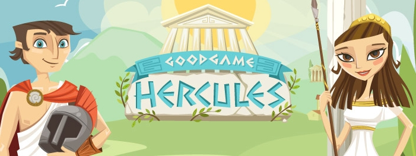

*Character selection*<br/>
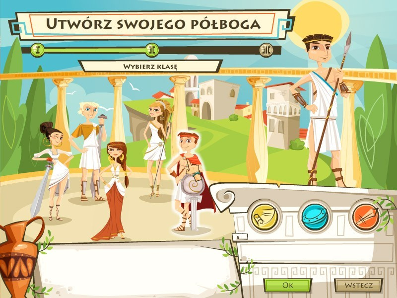

*Character selection*<br/>
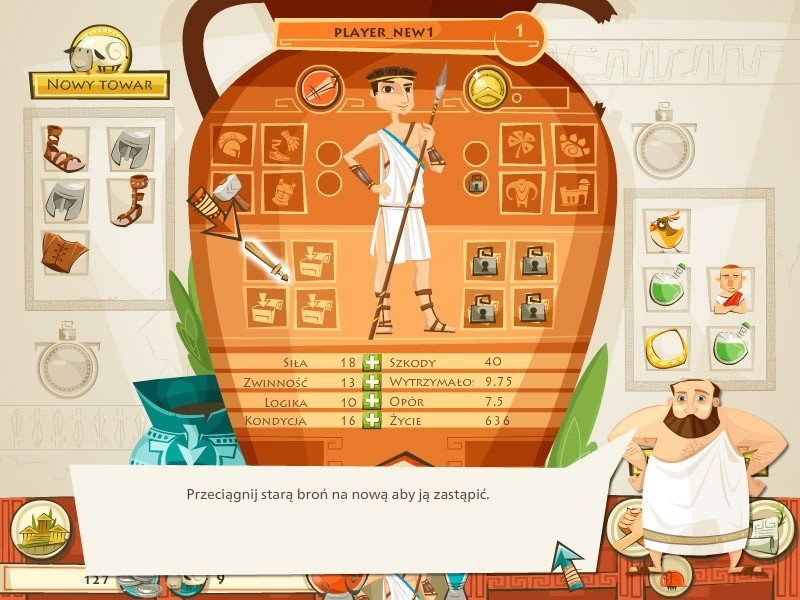

*Character selection*<br/>
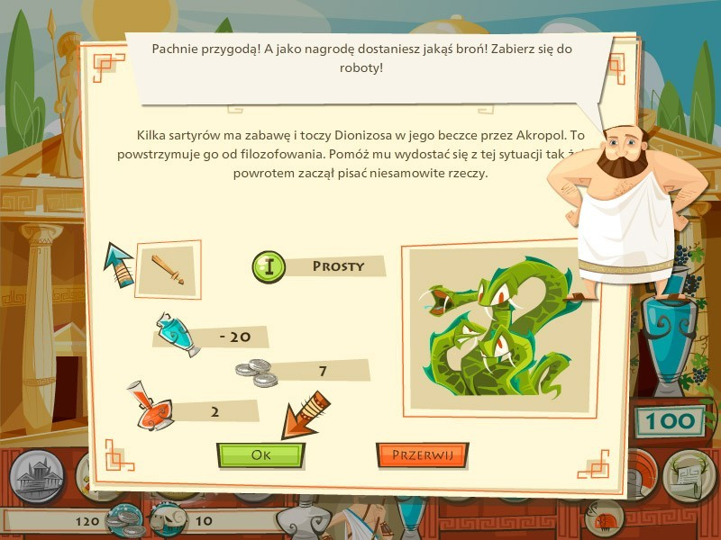

*Character selection*<br/>
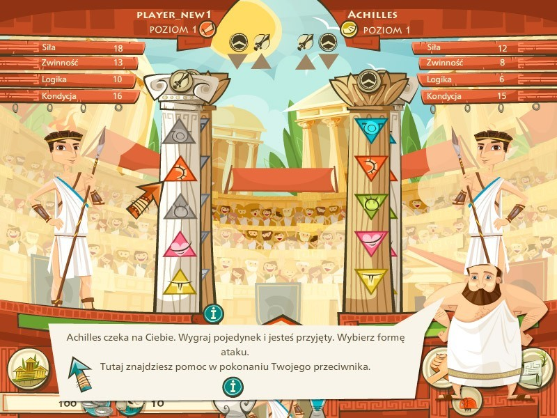


### Goodgame Heroes

> Odd characters are sitting in the tavern, waiting for a willing hero, brave enough to carry out their assignments. “Hey you,” the two-headed ogre shouts, “just the man I need! In the valley of flames lives a dragon with a sore throat in desperate need of his medicine. Could get heated for you but you’ll receive huge amounts of gold and experience points. Sounds tempting, doesn’t it?”

During my Bachelors Degree at SAE Institute Hamburg, Good Game Studios wanted to develop and publish a new game based on the working game concept of Goodgame Mafia but with a different setting. I took the opportunity to develop Goodgame Heroes with a new framework, which was used later also in GGS Mafia as a technical update.

*Character selection*<br/>
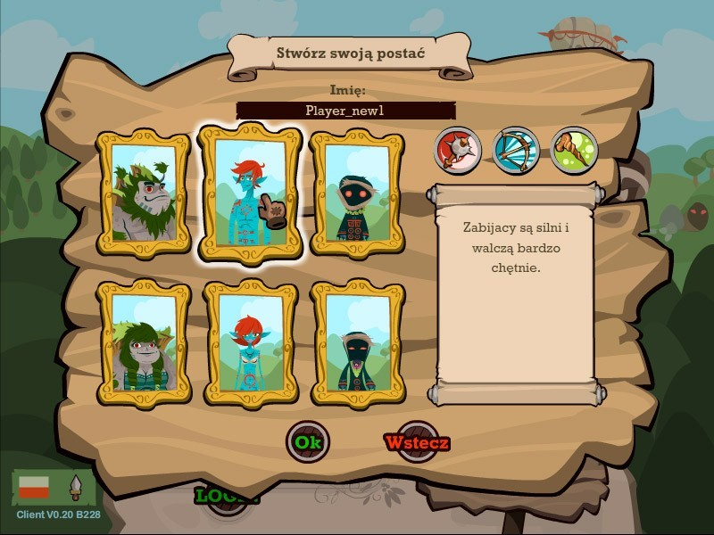

*Character screen*<br/>
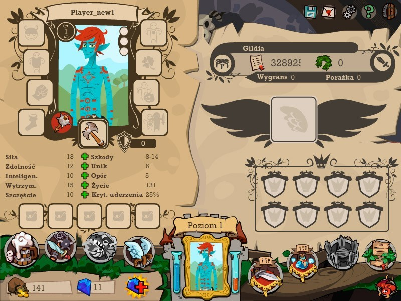

*Quest selection*<br/>
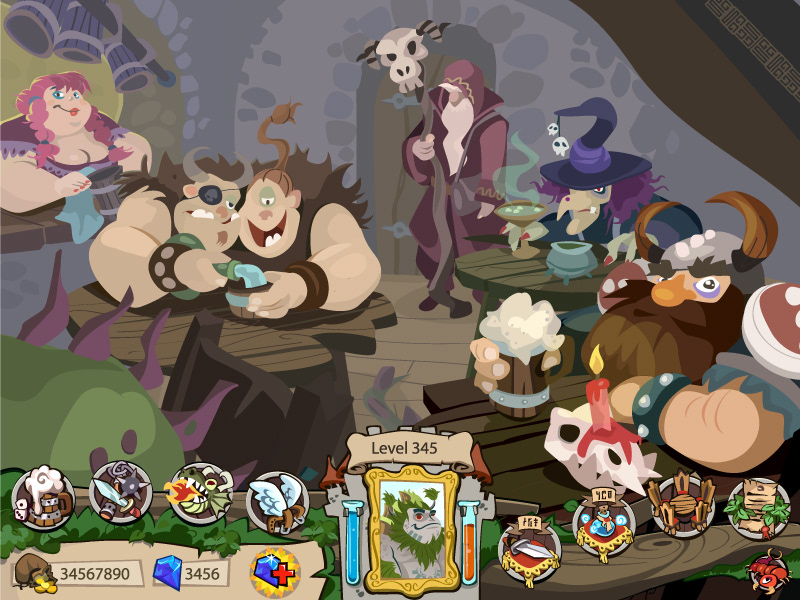

*Quest details*<br/>
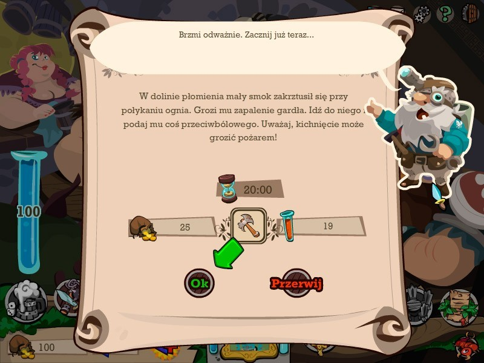

*Fight screen*<br/>
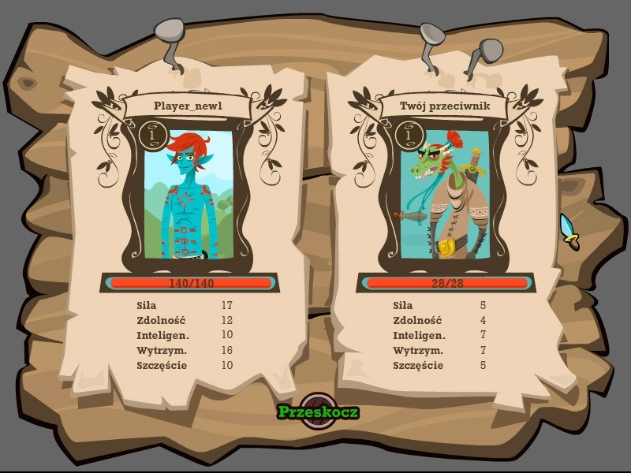

### Goodgame Mafia/Gangster

>In Goodgame Gangster the player slips into the role of a young and aspiring mobster who, among other things, needs to complete missions for the godfather in order to climb the career ladder. Most popular among the enthusiastic players are multiplayer elements like forming families or fighting against other ambitious crooks from all over the world.

As leading Frontend developer my team and I developed this beloved game project on time which helped the company to grow from 20 employees to one of Germany's biggest game companies. We developed the game in Action 3, using state machine design pattern and async Server Client communication. The game got translated into numerous languages, making it available for almost every country. 

In 2012 the game was rebranded from Goodgame Mafia to Goodgame Gangster and received a polished design.

Until the fully deprecation of the Flash Browser Plugin the game is still enjoyable at https://gangster.goodgamestudios.com/

*Version 1 of the Profile page*<br/>
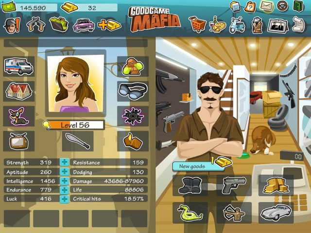

*Version 2 of the Quest page*<br/>
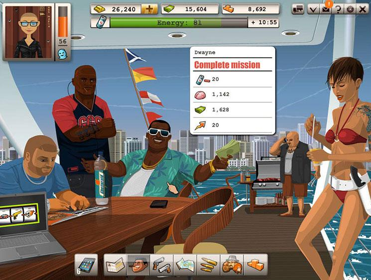

*Version 2 of the Shop page*<br/>
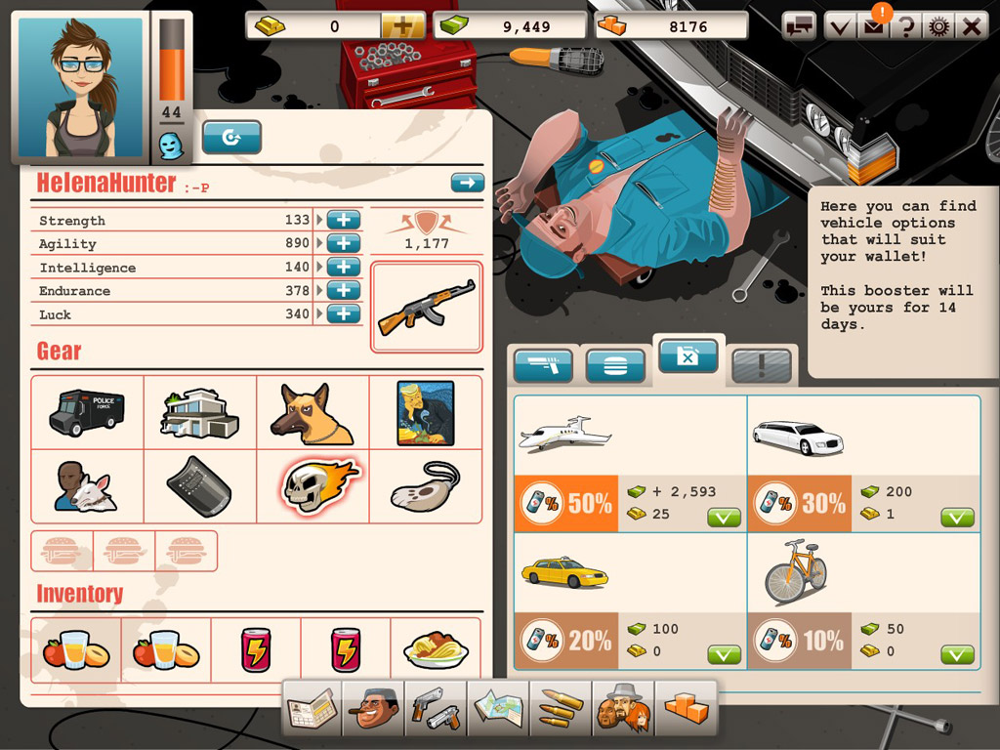

*Version 2 of the Fight page*<br/>
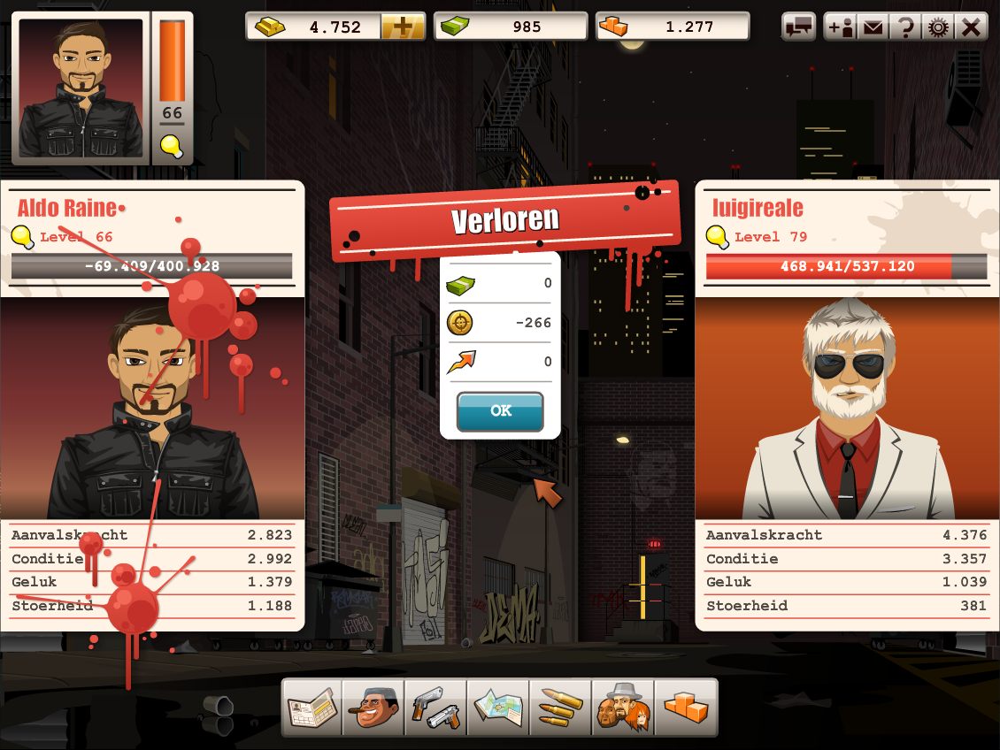


