## My projects in chronological order

* [nebenan.de](#nebenande)
* [HeyJobs 2019-2020](#heyjobs-2019-2020)
* [Self-watering Plant Pot Device using Arduino](#self-watering-plant-pot-device-using-arduino)
* [Klara](#klara)
* [WeSource](#wesource)
* [HeyJobs 2016-2017](#heyjobs-2016-2017)
* [Football Clash](#football-clash)
* [Memorado - Brain Training App](#memorado---brain-training-app)
    + [Web games](#web-games)
    + [Mobile apps](#mobile-apps)
* [Goodgame Galaxy](#goodgame-galaxy)
* [Goodgame Hercules](#goodgame-hercules)
* [Goodgame Heroes](#goodgame-heroes)
* [Goodgame Mafia and Gangster](#goodgame-mafia-and-gangster)

 

 

### nebenan.de

nebenan.de is Europe's largest social network for neighbors. 

During my time at nebenan.de, my responsibility was to guide and coach three Product Managers, one UX Designer, and one CRM Manager. This was a very exciting and educational phase that I will miss a lot. All three PMs had different Skill levels which brought the awesome challenge to develop a specific development path for each of them. The CRM Manager was in the phase of a Braze integration where my expertise in APIs was welcome. And the UX Designer was on her way into Maternity protection so it was my pleasure to help with hiring, onboarding, and supporting the new one. Still, I'm not very good at UX Design but enabling them and bringing them deeply into Product Discovery and Development is a strength of mine.

Working on the Product Strategy in collaboration with my Product Managers and Stakeholders was one of the great efforts I deeply enjoyed. I conducted Product Visions and Principles workshops for our two main products to bring the teams on board and create a shared understanding.

Another aspect of my work was building relationships with key stakeholders in the company and providing clear communication about the holistic roadmap. Tools to achieve this, where the OKR framework, regular Pitch sessions, Demo sessions, and updates in the company-wide All-hands meetings. Of course, not everything went perfect and I need to learn some bigger lessons in regards to the needs and approaches of influential sales stakeholders. 

 

 

### HeyJobs 2019-2020

Between 2017, the year I left HeyJobs, and 2019, HeyJobs grew into a more mature company. So did the Recruiter Portal Product. As Interim Product Owner it was my responsibility to lift the product to a more Self-Service one. 
Therefore, by conducting data and qualitative user feedback, the team and I, worked on features and improvements to promote better usability of the existing product but also enabled new user-workflows.
With the new Screening Question Catalog, recruiters are now able to select qualitative questions from the curated catalog, helping them to ask the right questions to the jobseeker. HeyJobs profits from the catalog by having the context of the questions selected, helping us to have more information about the jobseeker, which can be feed into the machine learning algorithm. In the end, we can provide better fitting candidates to our clients resulting in more hires.
The new statistics feature had to fulfill two desires. The first one was to give recruiters a self-service tool to sell HeyJobs internally to decision-makers. We introduced more valuable KPIs but also changed the analytics scope to make different publishing periods comparable. The second requirement was to relieve our internal account management team from the effort to send out Excel files manually before regular performance calls. Now during these performance calls, the account manager and recruiter can talk about the same data. We achieved this, by normalizing all data presented to the recruiter and account manager. This is a big win on both sides.

*HeyJobs Recruiter Portal Dashboard* 
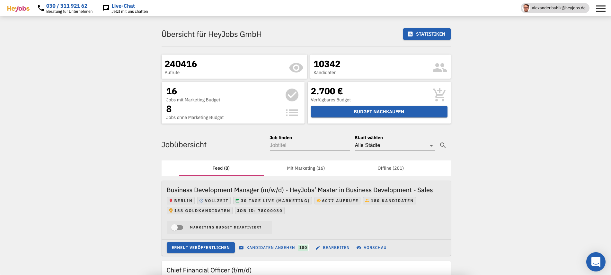

*Screening question catalog launched February 2020* 
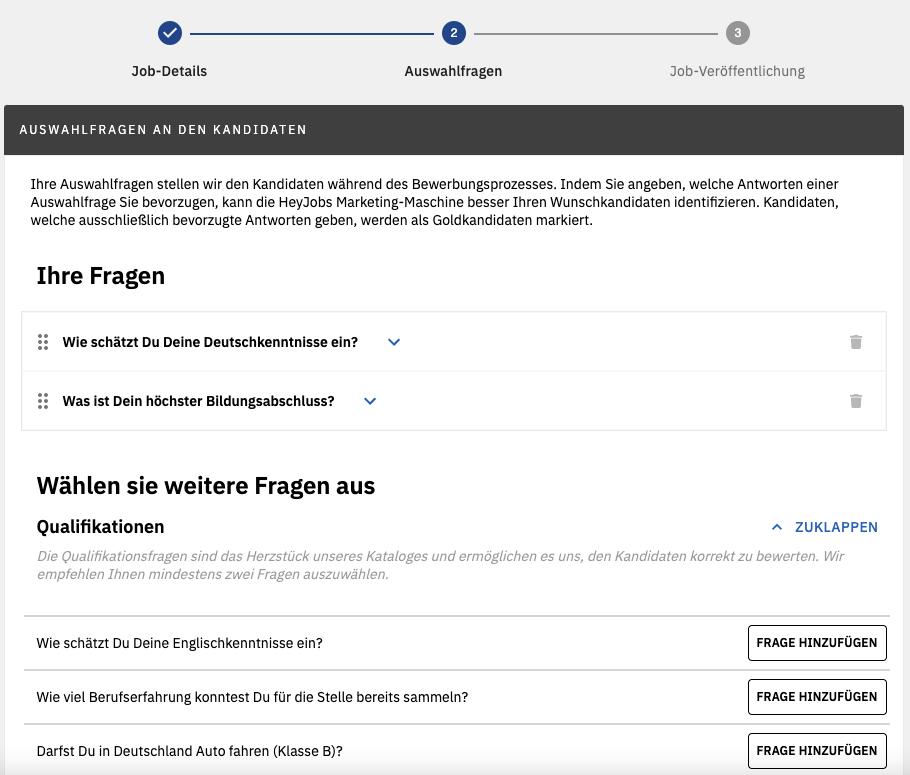

*New statistics launched November 2020* 
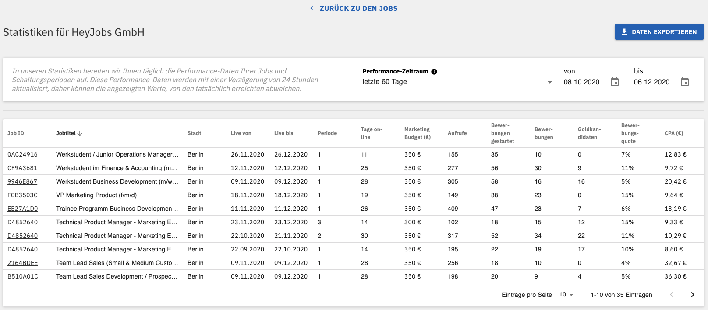

 

 

### Self-watering Plant Pot Device using Arduino

The goal of the project was to develop a prototype that waters a minimum of 5 plants automatically using the Arduino platform. The challenges were the craftwork (wood, plastic, electronics) and combining this with water. To provide water to every plant pot equally I needed to iterate on the hose system. Additionally, C++ was new to me and I needed to learn it from scratch.

Currently, the prototype is working well, the plants are growing nicely. The next steps are a growing light system for the darker months and a different base construction to be able to plug the device on a wall.

Feel free to check out the code, fork the project or contribute: [GitHub Repro](https://github.com/alexanderbahlk/andruino_interval_watering_with_waterlevel_check_and_rgb_led)

*Plant pot device for 5 plants* 
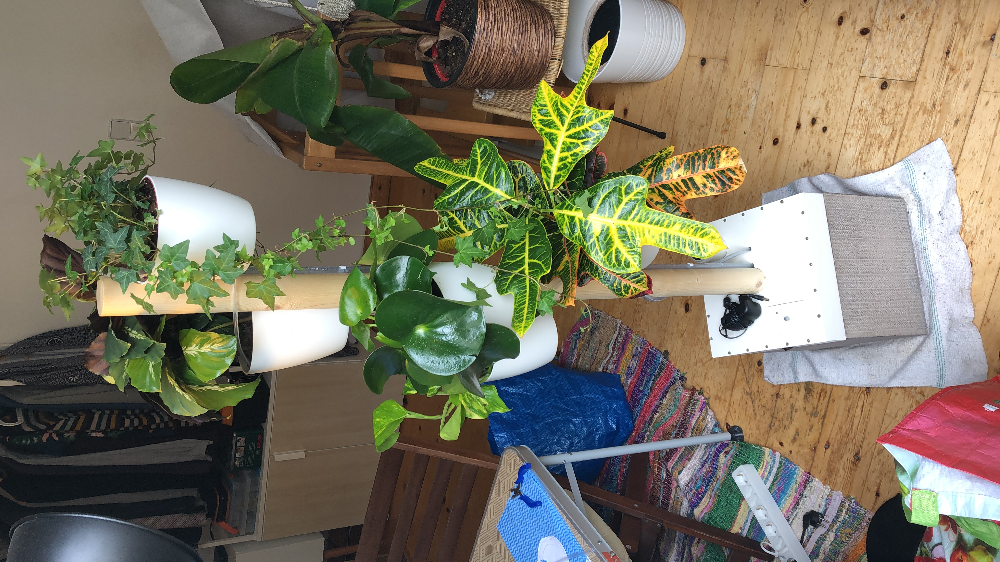

 

 

### Klara

> Klara’s end-to-end virtual care platform helps practices stay connected with their patients.

At Klara, a health care communication platform, the development team in Berlin and I successfully migrated the legacy data model to a new one, which supports future EHR integration in the health care sector.

Within 4 months we developed and shipped two major EHR integrations with https://www.nextech.com and https://www.athenahealth.com using the HL7/FHIR Cloud API.

[Website](https://www.klara.com/)

*Web and mobile access* 
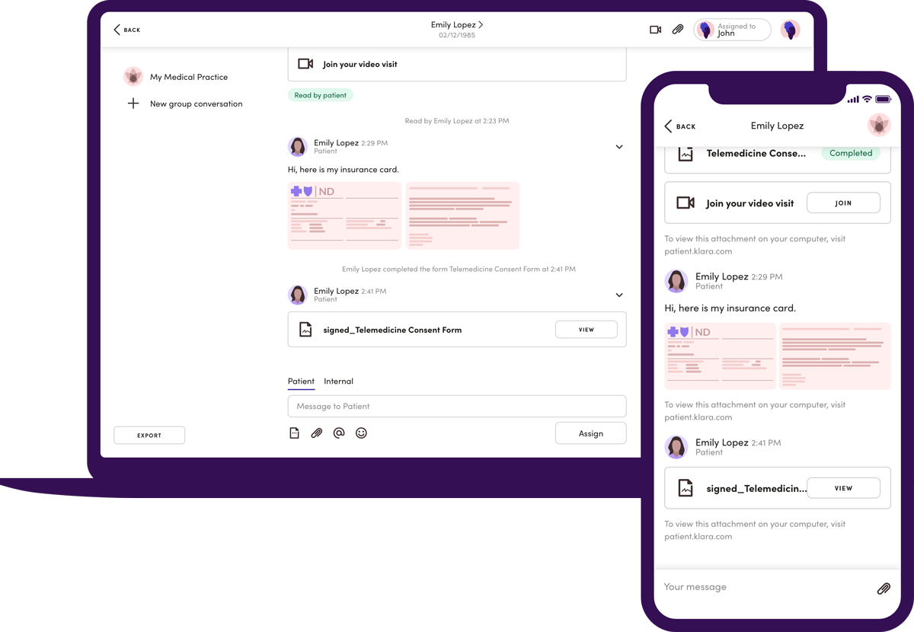

*Chat or Video call the practice* 
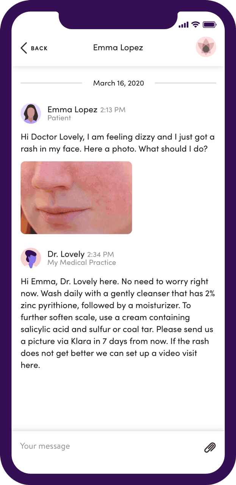
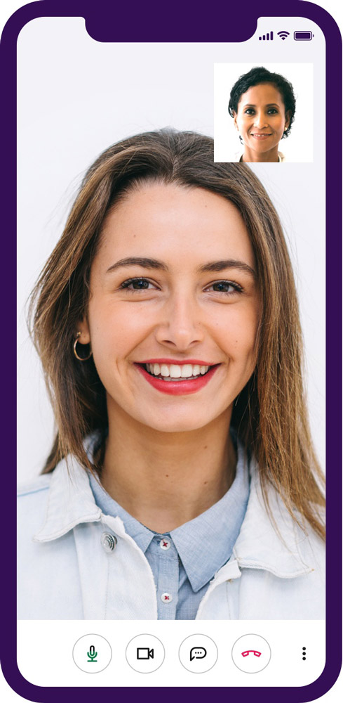

 

 

### WeSource

In Mid 2017 my co-founder and I started our own company WeSource UG. Our vision was to give recruiters and hiring managers the opportunity to reach out to passive candidates with a personal message to increase the response rate. Users on LinkedIn and XING are flooded with messages on daily basis missing out on great conversations and new opportunities.

Within the first 6 months we:
* applied successfully for the German Gründerzuschuss to receive 35.000€ in total as start investment
* built the wesource.io MVP in 4 weeks based on customer interviews in an agile process
* applied successfully to the TheFamily acceleration program to get valuable business feedback and contacts and receive perks such as AWS credits to save hosting costs
* sold the service to customers like Deutsche Post, 1&1, Deutsche Bahn, Raisin, headhunting agencies and more

As the CTO, I developed and released the wesource.io application in a fast and cost-efficient way using Ruby on Rails, PostgreSQL, JavaScript, and jQuery. While getting more and more customers I transferred our application from Heroku to AWS EC2 using Dokku. With this transfer, we were able to save 80% of hosting costs and were additionally more flexible in scaling the application. I also built an internal lead generation tool to scale the email outreach to 400 targeted leads per month.

FEATURES
* Recruiters can create message templates with a variety of templates
** Up to 30 placeholders
** Multiple salutations
** Analysed candidate experience
** Analysed candidate positions
** Additional placeholders covering soft skills and hobbies
* Recruiters can create a Boolean String for every vacancy enabling them to find great candidates on LinkedIn and XING
* Recruiters can create a personalized message while browning a candidate profile on LinkedIn and XING using a Chrome Extension or Firefox Addon
* Recruiters can manage their account with the admin area
** Manage vacancies (message and Boolean String)
** Customer information
** Self Service Checkout
** FAQs

*Website en* 
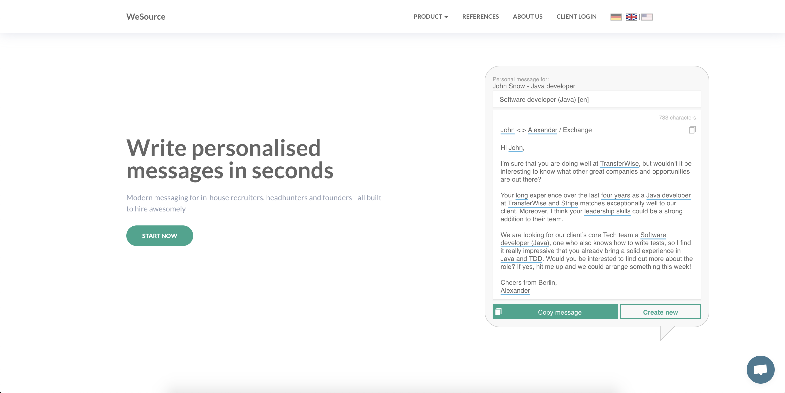

*Website de* 
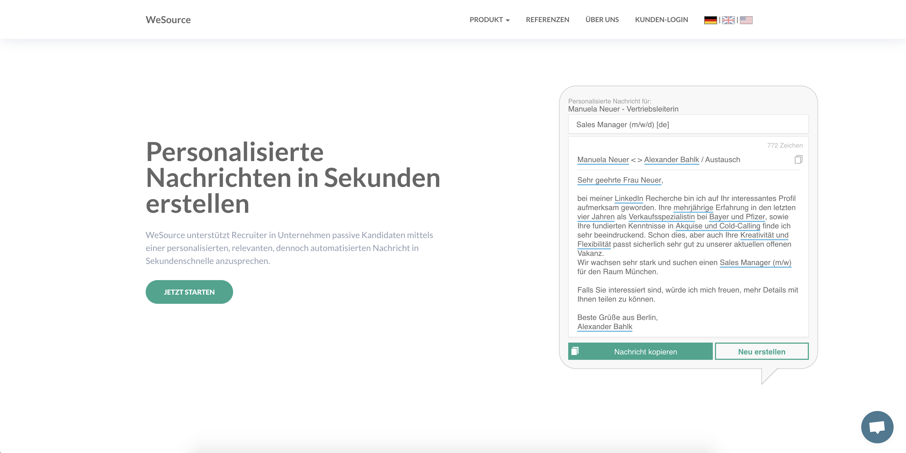

*Edit message* 
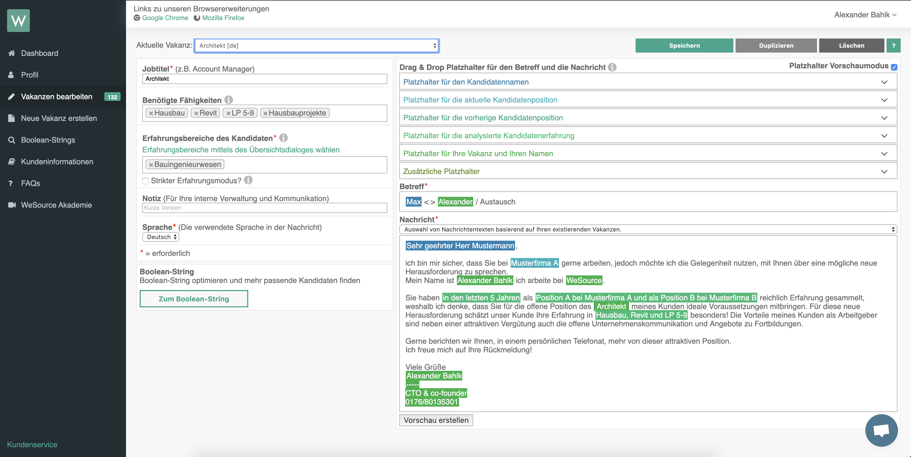

*Create personalised message on LinkedIn* 
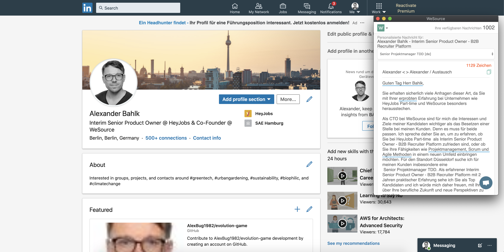

 

 

### HeyJobs 2016-2017

In early 2016 the founders of Memorado decided to pivot. I an idea generation process HeyJobs, a product that allows job seekers to apply more easily to job offers, was born and initially released in April 2016 after 8 weeks of development.

Within 12 weeks we developed the MVP, using Xamarin as the cross-platform solution, and the RoR backend. The product development process, developed at Memorado helped to achieve this milestone. During the next month, I also took over the TPM responsibility for the Backend project. Every week, the team and I integrated new job platforms to spread the job offers of our customers (30 in the end including Indeed, eBay classified, Jobbörse), improved the speed of our operations team with new internal tools, and served new API endpoints to improve the web interface.

FEATURES in 2016
* Jobseekers can search for nearby jobs
* Jobseekers can easily apply to suitable jobs on the mobile device
* Jobseekers can create a beautiful looking and appealing CV and attach it to every application

[Website](https://hire.heyjobs.co/en-us/)

*HeyJobs Features 2016* 
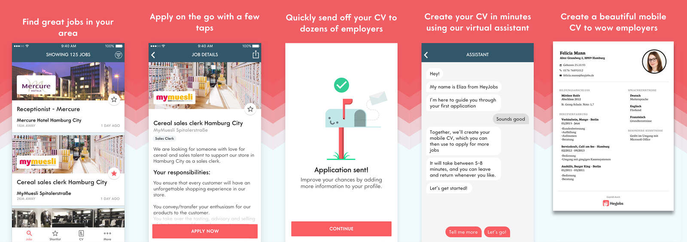

*Recruiter Create a job screen* 
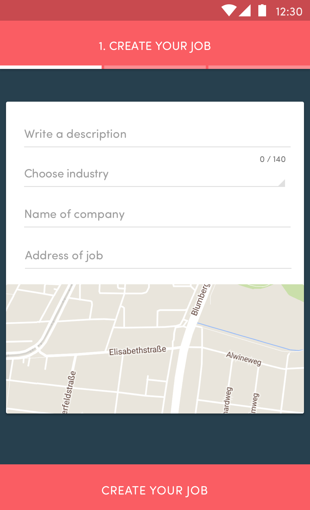

*Jobseeker Discover job destails * 
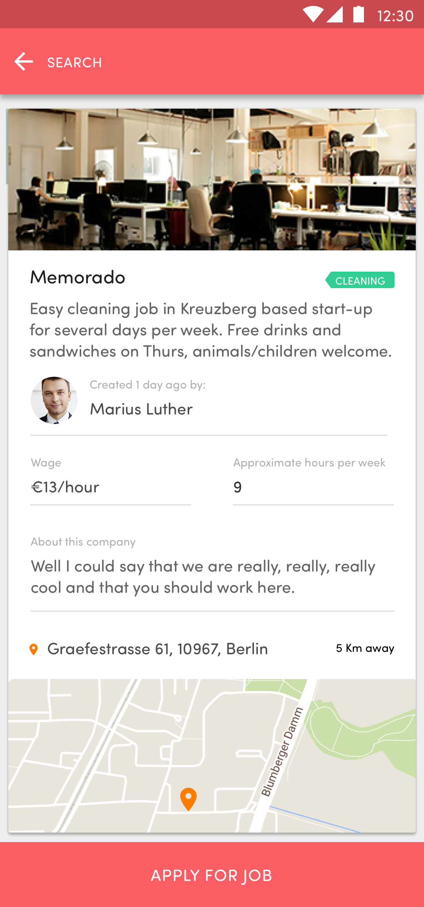

*Jobseeker Chat with HeyJobs* 
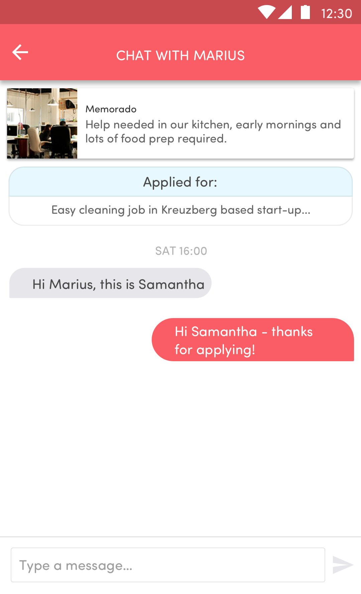

 

 

### Football Clash

> Football Clash is the unique 2D football turn based strategy game. ⚽️
>
> FEATURES
> * Unique genre mix - turn bases strategy meets football
> * Team variety - choose from 40 national teams
> * History campaigns - replay 7 tournaments: Mexiko 1986, Portugal 2004, Germany 2006, Venezuela 2007, Poland/Ukraine 2012, Brazil 2014 and France 2016
> * Game modes - single match, 1player or 2player hot seat, tournament and penalty shoot-out
> * Offline playability - no internet connection required and playable for free

This project started as a hackathon with friends and turned into a fully mobile game for Android. We developed the game with Unity, which was exciting because I was new to it. But the learning curve was steep and we were able to develop features quite fast.

The game is still downloadable and playable on Android: [Link](https://play.google.com/store/apps/details?id=air.com.hotfixgames.footballclash&hl=en)

*Gameplay screen* 

*Tournaments screen* 

 

 

### Memorado - Brain Training App

Memorado was successful brain training app, in which users could train their brain memory, reaction and concentration functions. Memorado was rebranded into [Geist](https://apps.apple.com/de/app/geist-memorado-gehirntraining/id897062509) recently

#### Web games

Memorado started as a web-based product for users interested in brain training.
I joined as a Games Developer to develop more ActionScript 3 games. On a weekly to bi-weekly basis be launched new games to keep users engaged and to increase the portfolio. This turned out be out very successful which lead to the start of the mobile apps.

*Web header from Landing page* 

*Web features* 

*Web Memory games* 

*Web workout finished* 

#### Mobile apps

As the market demanded mobile first, Memorado moved the focus to the Android and iOS app. While hiring the Android team, I already started to develop the Android App from scratch. The hired team helped me launching the app on time.
In mid 2015 I took over the Project Management of both the Android and iOS app and also the Product Management of the RoR backend product, switching my career path from Developer to Project and Product Manager.

*Android store* 

*App home screen* 

*App marketing header* 

*iOS games list* 

 

 

### Goodgame Galaxy

> Outer space. A galaxy far, far away. Who didn’t dream of conquering the universe as a child? As of today, Goodgame Galaxy, the newest free online game from the
>
> Hamburg-based developer Goodgame Studios gives you the chance to do just that. Various challenges await you as commander of your own space station. To begin with, the base is made up of little more than a few buildings - not a powerful and mighty space station at all. This makes it necessary to secure supplies of resources through the construction of production facilities, to arm your defenses and to manufacture your first spaceships to attack enemy bases. The launch already sees Goodgame Galaxy players given the choice between five different kinds of gun turrets, six types of space ships and 30 different building modules. In addition, players can develop bigger and stronger buildings, gun turrets and units through research. In total, there are up to nine upgrade levels at your disposal.
>
> Apart from expanding your base, focus is also placed on thrilling space battles. Unlike many browser games, Goodgame Galaxy battles are calculated in real time. This means that the player, as commander of their fleet, can make alterations to his tactics during combat. It also means that the different arrangements of defenses and differing buildings require a unique strategy with each attack. In this way, the battles contain elements of the much loved tower defense genre. Opponents include computer controlled bases, but above all, other real players from across the world. In addition, players can come together to form powerful alliances, in which players support each other, and conquer the galaxy together.

Goodgame Galaxy marked the peak of what is possible in Actionscript 3 games. The game looked amazing in terms of the UI and the 3D objects with animations. Under the hood, we developed an Entity Component System as the Game Engine. In combination with State Machines and the Decorator Pattern we were able to work fast and efficient to implement new Game Designs.

I am still very proud of the team and me. We build the most advanced game at Goodgame Studios at that time and also delivered a game users loved. Unfortunately, it could not hold up to the expectations of the company in terms of revenue and was discontinued 2013. But it was the technical foundation for their hit game Goodgame Bigfarm.

*Early base* 

*Full base* 

*Laser Canon* 

*Reserach center* 

*Enemy base* 

*Fight with explosions* 

*Map to reach other bases* 

 

 

### Goodgame Hercules

> Facing a dangerous hydra, getting in the ring with Hercules, taking a flight on the back of the winged horse Pegasus, or even being in service of the father of gods Zeus – all these exciting adventures are possible with Goodgame Hercules.
>
> Live combats against real players stand in the spotlight of this fascinating browser game. The innovative combat system with multiple tactical options, allowing a free choice between offensive and defensive actions, guarantees an enduring diversity of game experience. A number of combat skills can be additionally trained and enhanced. Furthermore, in the mythic world of Goodgame Hercules players can also complete single campaigns or become involved in group-based assignments. Each
player can decide whether to meet all these challenges as an athlete, a philosopher or a warrior. The top of Olympus can be reached in no time by those who manage to use their experience points efficiently and acquire the necessary weapons from the merchants. But can it be also successfully defended from the numerous rivals?

With the knowledge and learning taken from Goodgame Studios made the bet on anther title similar to Goodgame Mafia and pulled off Goodgame Hercules. While it looks very similar to Goodgame Mafia and Hereos, the key difference is the fight mode which offers more variety. This fight mode required us to rethink the server client communication to make it faster and more reliable.
Additionally, the tutorial system was redevolped to allow more flexiablity for the Game Design.

*Character selection* 

*Character selection* 

*Character selection* 

*Character selection* 

*Character selection* 

 

 

### Goodgame Heroes

> Odd characters are sitting in the tavern, waiting for a willing hero, brave enough to carry out their assignments. “Hey you,” the two-headed ogre shouts, “just the man I need! In the valley of flames lives a dragon with a sore throat in desperate need of his medicine. Could get heated for you but you’ll receive huge amounts of gold and experience points. Sounds tempting, doesn’t it?”

During my Bachelors Degree at SAE Institute Hamburg, Good Game Studios wanted to develop and publish a new game based on the working game concept of Goodgame Mafia but with a different setting. I took the opportunity to develop Goodgame Heroes with a new framework, which was used later also in GGS Mafia as a technical update.

*Character selection* 

*Character screen* 

*Quest selection* 

*Quest details* 

*Fight screen* 

 

 

### Goodgame Mafia and Gangster

>In Goodgame Gangster the player slips into the role of a young and aspiring mobster who, among other things, needs to complete missions for the godfather in order to climb the career ladder. Most popular among the enthusiastic players are multiplayer elements like forming families or fighting against other ambitious crooks from all over the world.

As leading Frontend developer my team and I developed this beloved game project on time which helped the company to grow from 20 employees to one of Germany's biggest game companies. We developed the game in Action 3, using state machine design pattern and async Server Client communication. The game got translated into numerous languages, making it available for almost every country. 

In 2012 the game was rebranded from Goodgame Mafia to Goodgame Gangster and received a polished design.

Until the fully deprecation of the Flash Browser Plugin the game is still enjoyable at [Link](https://gangster.goodgamestudios.com/)

*Version 1 of the Profile page* 

*Version 2 of the Quest page* 

*Version 2 of the Shop page* 

*Version 2 of the Fight page* 

